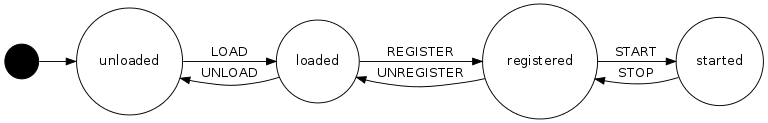
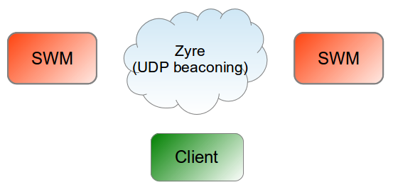
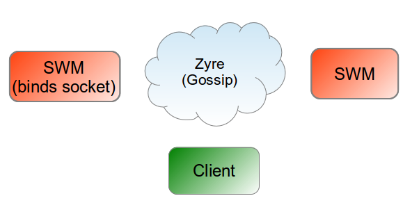
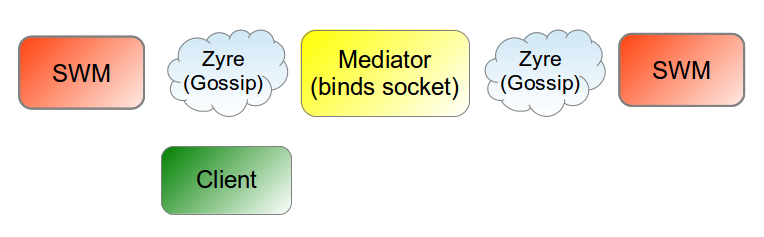
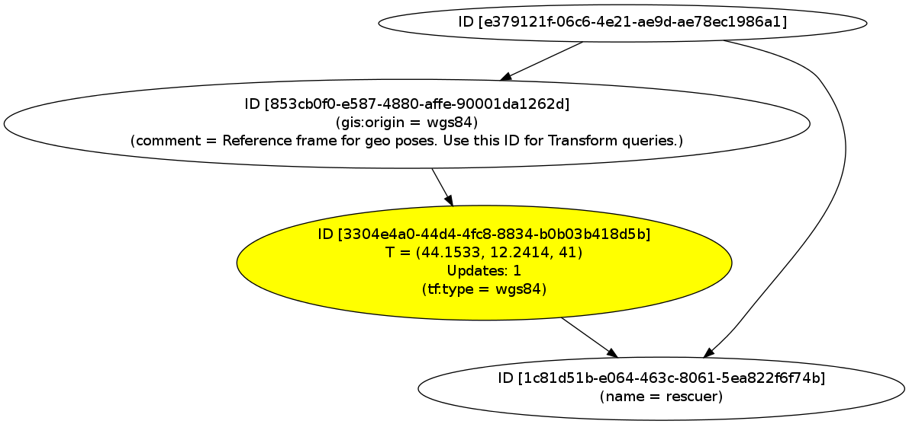

# SHERPA World Model User Manual

The **SHERPA World Model** (SWM) is a distributed environment representation for
robots based on the Robot Scene Graph (RSG) data representation.  

This manual describes the following aspects of the world model:

 1. The [data model](#data-model)
 2. The [update](#updates) capabilities
 3. The [query](#queries) capabilities
 4. The [monitoring](#monitors) capabilities
 5. The [distribution](#distribution) capabilities
 6. [Launch options](#launch-options)
 7. World model [debugging](#debugging) technique
 
## Data model

The underlying data model is a graph. Nodes can represent physical and virtual 
objects in the environment. Their relations are expressed by edges. There are 
different types of nodes and edges. We denote such a graph as *Robot Scene Graph
(RSG)*. 

Nodes are distinguished between *inner nodes* 
and *leaf* nodes. An inner node is labeled as **Group** and a leaf as **Node**. 
Groups are used to model containment of objects. E.g. a room can *contain* chairs 
and tables. Another example is a search area in a Search And Rescue (SAR) mission that
*contains* found victims. In that case the room and the search area would be represented
as **Groups**. **Nodes** are used to model entities in the environment that do not
*contain* further objects like a way point on a path or a sensor measurement. 
   
All nodes (i.e. inner nodes and leaf nodes) share common properties:

* Each node has a *Universally Unique ID*s (UUID) according to 
  [RFC 4122](https://www.ietf.org/rfc/rfc4122.txt). This is used as
  a primary key to address all primitives in the graph. 
* Each node can have multiple *parent* nodes. The root node is a node that has no
  parents.
* Each node has attached [**Attributes**](#attributes). These attributes are stored as a list 
  of key value pairs. This mechanism allows to tag graph entities with e.g. 
  semantic attributes or debug information. However the exact usage and meaning
  depends on the actually application and requires a convention.

For inner nodes (Groups) the following additional property holds:

* Each **Group** can have multiple child nodes. Parents and child nodes effectively form a
  Directed Cyclic Graph (DAG). This reflects a hierarchically modeling of containment
  relations. E.g. the following parent child relation ``building->room->chair`` means ``building``
  contains ``room`` and ``room`` contains ``chair``. The containment relation is *transitive*, thus
  the ``building`` contains the ``chair`` as well. 

There are also more specialized [nodes](#specialized-nodes) and 
[edges](#specialized-edges) es explained later. For instance the **Transform**
is used to represent rigid transforms between objects.

### Attributes

Each node i.e. all **Nodes** and **Groups** can have attached attributes.
A single **Attribute** is an information that can be attached, removed or altered
at any point in time. (In contrast to a *property* which is understood here as an
information that always has to be present). In the remainder of this manual
we use the following tuple notation for an **Attribute**: (``attribute``,``value``)
An example of an attribute is a human readable ``name`` for an object: (``name``,``robot_123``).

The **Attributes** allow to start a search queries on all primitives in the Robot Scene Graph
and identify those nodes specified by the attributes. Further details on how to query the graph
can be found in section [Queries](#queries).

The **Attributes** concept can be seen as "semantic tagging" of the elements in a scene. 
These tags could contain generic information like a name or a node type or task specific tags.
In order to better structure the semantic meaning of attributes we define that 
**Attributes** belong can belong to a *Semantic Context*. 

A *Semantic Context* groups all possible attribute-value combinations that can be interpreted
within a certain context. e.g. tags for the domain of geometric shapes, rigid transforms or application
specific ones. A *Semantic Context* is formalized in a (JSON) Schema definition. Per convention 
a unique namespace identifier is used as a prefix to the ``attribute``, separated by a colon ``:`` 
to reference to a specific *Semantic Context*. 
An example is  (``tf:max_duration``,``10s``) for the *Transform* domain that uses ``tf`` as a prefix.

Attributes that do not belong to a *Semantic Context* are not supposed to by interpreted, though they
can be helpful to improve human readability or can be used for debugging purposes. 


### Specialized Nodes

#### GeometricNode

A GeometricNode to stores geometric shape data as a leaves node in the RSG. 
The geometric node is a rather general container for any kind of 3D data.
Possible data ranges from rather primitive shapes like a box or a cylinder to
unconstrained geometries like point clouds or meshes. A GeometricNode can
be used to store measurements from sensors.

#### Sherpa specific Nodes


* **ARTVA Signals**: A single ARTVA measurement is represented by a single ``Node``, 
which is tagged with a ``sherpa:artva_signal`` **Attribute** e.g. (``sherpa:artva_signal``,``77``).
It typically has a Connection to a GIS origin via a **Transform** to inticates its geo-pose. 
Examples to [add](../examples/json_api/add_artva_signal.py) and [query](../examples/json_api/get_artva_signals.py) ARTVA measurements can be found in the JOSN API section.

The complete list of Attributes used for a SHERPA mission can be found in the [codebook](https://github.com/blumenthal/sherpa_world_model_knowrob_bridge/blob/master/doc/codebook.md).

### Specialized Edges

So far nodes can be related via *containment* relations, which are modeled as parent-child
edges. However, a robotic environment representation exhibits much more relations
including topological relations (on, near) pose information and others. A generic 
relation between nodes is labeled as **Connection** while pose information
is modeled with **Transforms**.

#### Connection

TBD

#### Transform

TBD

## Updates

An update is defined as a **C**reate, **U**pdate or **D**elete operation on the
primitive elements of the Robot Scene Graph. I.e. it is possible to add new
objects to the world model by creating a *Group* or *Node*, adding a *Transform*
primitive (to represent relative poses between nodes) and by attaching any 
additional [Attributes](#attributes) as needed. 

Different interfaces for interacting with the RSG exist for 
[C++](http://www.best-of-robotics.org/brics_3d/classbrics__3d_1_1rsg_1_1ISceneGraphUpdate.html), 
[Java](https://github.com/blumenthal/brics_3d_jni/blob/master/java/RobotSceneGraph/src/be/kuleuven/mech/rsg/Rsg.java)
 (which is not feature complete!), and [JSON](../examples/json_api). 

The following table with pseudo code illustrates the update **operations** on the graph primitives:


| Operation            	| Pseudo Code                                                                      			| Description                                                                                                                                                                                                                                                                   	|
|----------------------	|-------------------------------------------------------------------------------------------|-------------------------------------------------------------------------------------------------------------------------------------------------------------------------------------------------------------------------------------------------------------------------------	|
| Create Node          	| ``addNode(id, parentId, attributes)``                                         			| ``id`` specifies the UUID. If not set the implementation will generate one. The ``parentId`` denfines the parent note. In cases of doubt use the root node id. ``attributes`` defines a set of initial Attributes. They might be updated in later steps and can be empty as well. 	|
| Create Group         	| ``addGroup(id, parentId, attributes)``                                        			| Same for id, parentId and attributes as for Create Node operation.                                                                                                                                                                                                                                           	|
| Create GeometricNode 	| ``addGroup(id, parentId, attributes, geometry, timeStamp)``                   			| Same for id, parentId and attributes as for Create Node operation, but the geometric shape like a box for instance has to be defined. The time stamp denotes the creation time. The geometric data is immutable. Though the GeometricNode might be deleted as a whole.                                             |
| Create Connection    	| ``addConnection(id, parentId, attributes, sourceIds, targetIds, startTime, endTime)`` 	| Same for id, parentId and attributes as for Create Node operation. ``sourceIds`` and ``targetIds`` define sets of source/target nodes referred to by its IDs (ingoing/outgoing arcs) that will be set for the connection. Can be empty. ``startTime`` denots since when a connection is valid. Recommended is the time of creation. ``endTime`` denotes until when a connection is valid. Recommended is an infinite time stamp. Both time stamps can be updated later. |
| Create Transform     	| ``addTransform(id, parentId, sourceId, targetId, attributes, transform, timeStamp)`` 		| Same for id, parentId and attributes as for Create Node operation but the initial transform has to be given with an accompanying time stamp. The data can be updated afterwards. The ``sourceId`` and ``targetId`` denote between which nodes the transform holds. Cf. [Transform](#transform) section.                    	|
| Create Parent-Child   | ``addParent(id, parentId)`` 																| Adds an **additional** parent-child relation between ``id`` and ``parentId``. (There is always at least one during creation of a node.)             	|
| Update Attributes 	| ``updateAttributes(id, newAttributes)`` 													| ``id`` defines the node to be updated. ``newAttributes`` defines the new set of attributes that replaces the old one.  	|
| Update Transform	 	| ``updateTransform(id, transform, timeStamp)`` 											| ``id`` defines the Transform to be updated. ``transform``	holds the transform data that will be inserted in to the temporal cache at the given time ``timeStamp``.   	|
| Delete Node		 	| ``deleteNode(id)``							 											| The ``id`` the defines the node to be deleted.	|
| Delete Parent		 	| ``deleteParent(id, parentID)``							 								| Remove an existing parent-child relation between two nodes specified by ``id`` and ``parentId``. If the last perent is deleted, then it is treated as ``deleteNode(id)`` 	|

Examples for using the JSON API to update the graph can be found for [here](../examples/json_api)

## Queries

An query is regarded as a **R**ead operation on the graph. Depending on the type of 
query this can involve a traversal of the primitives in the graph.

### Queries on graph primitives

The below table with pseudo code illustrates the **queries** on the graph **primitives**:


| Operation            	         | Pseudo Code                                                                      	     | Description                                                                                                                                                                                                                                                                   	|
|--------------------------------|-------------------------------------------------------------------------------------------|-------------------------------------------------------------------------------------------------------------------------------------------------------------------------------------------------------------------------------------------------------------------------------	|
| Search nodes by Attributes     | ``findNodes(attributes, resultIds)``                                         			 | Find all nodes that have at least the specified ``attributes``. Regular exressions (POSIX) are possible as well. Returns ``resultIds`` which is a set of ids. 	|
| Search transform between nodes | ``getTransformForNode (id, idReferenceNode, timeStamp, transform)``                       | Calculates a rigid transform between nodes specified by ``id` and ``referecnceId`` in the graph. ``referecnceId`` denotes the *origin* of the transform. Depending on how the graph looks like there is not always a solution. |
| Read Attributes                | ``getAttributes (id, attributes)``                                         		         | Get the attributes of node with id ``id``. Returns all Attributes in output parameter ``attributes``.	|
| Read Parents                   | ``getParents (id, perentIds)``                                         		             | Get the parenbts ids of node with id ``id``. Returns all parents in output parameter ``parentIds``.	|
| Read Children                  | ``getChildren (id, childIds)``                                         		             | Get the child ids of node with id ``id``. Returns all childs in output parameter ``childIds``.	|
| Read Transform                 | ``getTransform (id, timeStamp, transform)``                                         		 | Get the data of a Transform with id ``id`` at time ``time stamp``. Returns entry that best matches the to the given time stamp.	|
| Read Geometry                  | ``getGeometry (id, geometry, timeStamp)``                                         		 | Get the data of a GeometryNode with id ``id``. Returns the geometric shape and the accompanying time stamp.	|


Examples for using the JSON API to query the graph can be found for [here](../examples/json_api)

### Complex queries based on query function blocks

A *query function block* is a computational module that can be loaded at run time.
Technically speaking it is a shared library, that can be loaded on demand and
contains a particular algorithm to efficiently (in-memory) compute a reply.
The repository for function block can be found [here](https://github.com/blumenthal/brics_3d_function_blocks) and is part of a standard 
installation. Some examples are:

* [posehistory](https://github.com/blumenthal/brics_3d_function_blocks/tree/master/posehistory): A query function block to retrieve the history of poses between two nodes in the scene graph
* [nodesinarea](https://github.com/blumenthal/brics_3d_function_blocks/tree/master/nodesinarea): A query function block to retrieve all node of the scene graph within an area
* [poselist](https://github.com/blumenthal/brics_3d_function_blocks/tree/master/poselist): A query to aggregate multiple pose queries into a single one, w.r.t to a single common reference and time stamp.

Client code can utilize these modules either by respective method calls on the 
C++ API or use special JSON messages. In fact the queries are quite similar to the
above queries for graph primitives. However there are two major differences:

1. Every query block has to be loaded first. If it is not loaded, all replies will return ``false``.
   Of course, a block can be also unloaded if desired. Note, blocks can also be loaded automatically on start up.
2. Every query block has its own data types for in and output. A data meta model 
   as JSON Schema defines how exactly to send and receive. 
   

Example JSON message for loading a block. In this example it is the a ``posehistory`` query function block:

```
{
    "@worldmodeltype": "RSGFunctionBlock",
    "metamodel":       "rsg-functionBlock-schema.json",
    "name":            "posehistory",
    "operation":       "LOAD",
    "input": {
      "metamodel": "rsg-functionBlock-path-schema.json",
      "path":     "/workspace/brics_3d_function_blocks/lib/",
      "comment":  "path is the same as the FBX_MODULES environment variable appended with a lib/ folder"
    }
}
```

**Troubleshooting:** If a block cannot be loaded, it either does not exist, its name is misspelled, or the path 
is not setup correctly. The above example uses the default path as used for the [Docker](../docker/README.md) container.

Example for sending a query. Note that the meta model convention is ``fbx-<blockName>-input-schema.json``:

```
{
    "@worldmodeltype": "RSGFunctionBlock",
    "metamodel":       "rsg-functionBlock-schema.json",
    "name":            "posehistory",
    "operation":       "EXECUTE",
    "input": {
      "metamodel": "fbx-posehistory-input-schema.json",
	    "id": "aeb8d5a4-12e2-45ff-9218-07186297577e",
	    "idReferenceNode": "e379121f-06c6-4e21-ae9d-ae78ec1986a1"
    }
} 
```

Example for querying the data meta model of a block. This is in particular useful, if it is not clear what has to be send.
The [meta models](https://github.com/blumenthal/brics_3d_function_blocks/tree/master/models) are also available in the block repository.

```
{
    "@worldmodeltype": "RSGFunctionBlock",
    "metamodel":       "rsg-functionBlock-schema.json",
    "name":            "posehistory",
    "operation":       "GET_METAMODEL",
}
```

## Monitors

A world model monitor raises events based on the changes of the model (here the graph) and if a certain condition is met. Examples are when attributes of a node change or new nodes are created.
This concept is alse known as *change feed* in e.g. RethinkDB.

A monitor is implemented via the *function block* mechanism. It allows to store a computation within the world model, that gets executed on every change. We refer to it as a *monitor function block*
In fact, it is quite similar to the idea of a function block. Still there is a slight difference:

 * The *function block* uses a query response pattern: A query is sent, the block gets executed and returns a reply. 
 * A *monitor function block* is triggered by a change not by a caller and it needs to continuously send data, thus it has conceptually some kind of an *output port*. 
   The SHERPA World Model connect this port to the Zyre communication framework in order send monitor messages. 

The function block mechanism allows to create custom monitors (if necessary) that can be load at run time. Thus, there can be different types of monitors. Currently two types are provided:

 * [onattributechange](https://github.com/blumenthal/brics_3d_function_blocks/tree/master/onattributechange): 
   A monitor function block that sends an event whenever a certain value of an attribute for a particular node has changed.
 * [oncreate](https://github.com/blumenthal/brics_3d_function_blocks/tree/master/oncreate): 
   A monitor function block that sends an event whenever a new Atom (e.g. Node, Group, Connection, ...) with a particular set of attributes is created.

As for every function block a monitor can only be loaded once. In order to allow multiple monitors with different triggering conditions of the same type **a single monitor function block** can register **multiple monitor listeners**. The work-flow to setup a monitor function block and a monitor listener involves to: 

1. **load** the monitor function block 
2. **register** monitor listeners and
3. **start** or **stop** it.

The below state machine diagram illustrates the necessary steps. A more detailed description can be found in the next section.



### Work-flow to setup a monitor

#### Load a monitor function block 

A monitor function block has to be loaded, if not done already. It is safe to load it even if it was loaded before. 
For testing and debugging purposes it can be useful to always unload first, such that the
latest compiled block is used. For an actual rescue mission this can be skipped. 


The following message loads a monitor block called *oncreate*. A complete Python example for the *oncreate* monitor can be found int the 
[sherpa_new_images_monitor.py](../examples/json_api/sherpa_new_images_monitor.py) script.

```javascript
{
  "@worldmodeltype": "RSGFunctionBlock",
  "metamodel":       "rsg-functionBlock-schema.json",
  "name":            "oncreate",
  "operation":       "LOAD",
  "input": {
    "metamodel": "rsg-functionBlock-path-schema.json",
    "path":     "/workspace/brics_3d_function_blocks/lib/",
    "comment":  "path is the same as the FBX_MODULES environment variable appended with a lib/ folder"
  }
}
``` 

``@worldmodeltype, metamodel, operation`` and ``metamodel`` in the input section are always the same. 
Only ``name`` and ``path`` need to be adopted. While name is the name of the monitor block. 
It **must match** the name of the pre-compiled shared library. E.g. ``oncreate.so`` and 
path must be the folder where the library is stored. This is the same as the ``FBX_MODULES`` environment variable.


#### Register a monitor listener

A monitor listener has to be registered to a monitor function block. 
It is possible to register multiple monitor listeners. E.g. one that listens to new images and one for detected victims. 
A ``monitorId`` has to be manually assigned, that will be used within
every message. It has to be a UUID like e.g. ``460b1aa5-78bf-490b-9585-10cf17b6077a``. 
The is allows to filter out monitor messages in a client program that do not belong to this monitor listener.


Every monitor has a different model for its input. Is is defined as a JSON Schema file that is references in the ``metamodel`` field.
The meta model for the *oncreate* monitor block  is defined in the file 
[fbx-oncreate-input-schema.json](https://github.com/blumenthal/brics_3d_function_blocks/blob/master/models/fbx-oncreate-input-schema.json).
Other input definitions can be fond in the same model [folder](https://github.com/blumenthal/brics_3d_function_blocks/blob/master/models) as well. 

The below message registers a monitor listener for the *oncreate* monitor.

```javascript
{
  "@worldmodeltype": "RSGFunctionBlock",
  "metamodel":       "rsg-functionBlock-schema.json",
  "name":            "oncreate",
  "operation":       "EXECUTE",
  "input": {
    "metamodel": "fbx-oncreate-input-schema.json",
    "monitorOperation": "REGISTER",
    "monitorId": "460b1aa5-78bf-490b-9585-10cf17b6077a",
    "attributes": [
      {"key": "sherpa:observation_type", "value": "image"}
    ] 
  }
} 
```

``@worldmodeltype, metamodel`` and ``operation`` in section are always the same for a registration. 
Also the field ``monitorOperation`` has to be set to ``REGISTER``. 

For the *oncreate* monitor ``attributes`` are set to define which freshly created nodes will 
trigger to send a monitor message. In this case for creation of new atoms with the attribute 
``(sherpa:observation_type = image)`` It allows to monitor when new images are inserted into the SWM.

#### Start a monitor listener

A monitor listener has to be stated in order to send messages. A listener can also be stopped and no further messages will be send unless 
it is started again.

The below message starts a monitor. Set ``monitorOperation`` to ``START`` or ``STOP``, 
and use the respective ``monitorId`` to identify the monitor lister. 
It is the same id as used in the previous step to register a monitor.

```javascript
{
  "@worldmodeltype": "RSGFunctionBlock",
  "metamodel":       "rsg-functionBlock-schema.json",
  "name":            "oncreate",
  "operation":       "EXECUTE",
  "input": {
    "metamodel": "fbx-oncreate-input-schema.json",
    "monitorOperation": "START",
    "monitorId": "460b1aa5-78bf-490b-9585-10cf17b6077a"
  }
} 
```

From now on the SWM will send monitor messages. Monitor messages always have

* the ``@worldmodeltype`` set to ``RSGMonitor`` and
* a ``monitorId``. It is the same as specified during registration of a monitor listener. 

```javascript
{
  "@worldmodeltype": "RSGMonitor", 
  "monitorId": "460b1aa5-78bf-490b-9585-10cf17b6077a",
  "id": "f63c7435-2a0d-3d5a-b0eb-1c05cce4642c", 
  "attributes": [
    {"value": "image", "key": "sherpa:observation_type"}, 
    {"value": "DE62677D546BC77B49A6FAEDDC9184AB:/tmp/image001.jpg", "key": "sherpa:uri"}, 
    {"value": 1484750000000.0, "key": "sherpa:stamp"}, 
    {"value": "fw0", "key": "sherpa:author"}
  ] 
}
```

The other fields depend on the type of monitor. In case for the *oncreate* monitor the ``id`` and the ``attributes`` are returned.
More details on the returned data can be found in the documentation for an individual monitor.

### Using the SWM Zyre client library to receive monitor messages
 
In order to receive monitor messages the [SWM Zyre client library](../examples/zyre) offers the ``register_monitor_callback`` function
to register a callback function that is triggered whenever any monitor message arrives. A C example is given in the
[sherpa_example.c](../examples/zyre/sherpa_example.c) program. It can be also used on a Python script as demonstrated in
the [sherpa_new_images_monitor.py](../examples/json_api/sherpa_new_images_monitor.py)


## Distribution

The distribution capabilities strive for all SWMs having a **local copy** of the 
(more or less) same Robot Scene Graph. Technically speaking, every update of
the SWM, that is the creation of new nodes or an update will be send to all
other listening SWMs. It can be seen as broadcasting diffs of the world model.
Here, the *Mediator* is in charge to properly broadcast the data to the other 
robots over a potentially unreliable network.

The SWM has a mechanism that sends the full graph to all other SWMs. It is triggered
when a new SWM comes "up". An *advertisement* message is send when a new SWM joins.
It is  also possible to trigger it in case of missing data (but this is not yet implemented).
For debugging purposes it can be triggered manually as well via the ``sync()`` 
[terminal commnad](#terminal-commands).

In all distribution scenarios all World Model Agents must have UUIDs and a communication framework with or 
without a Mediator (recommended) has to be selected.

### World Model Agent UUIDs

Before launching a distributed scenario every World Model Agent neds a UUID, thus every SWM 
has a unique UUID. It can set in the respective section in the ``sherpa_world_mode.usc`` file or as an
environment variable. If the agent IDs are the same, the *advertisement* message that automatically synchronizes agents on start up will be ignored! 

#### Manual setup

Set the environment variable ``SWM_WMA_ID`` to the UUID to be used. E.g.:

```
export SWM_WMA_ID=e379121f-06c6-4e21-ae9d-ae78ec1986a1
```


Or directly modify the default value in the usc file:

```
local worldModelAgentId = getEnvWithDefault("SWM_WMA_ID", "e379121f-06c6-4e21-ae9d-ae78ec1986a1") 
```

#### Automatic setup (recommended)

It is also possible to omit that step and let the World Model Agent automatically generate an ID.
Simply leave the SWM_WMA_ID empty:


```
 export SWM_WMA_ID= 
```

Of course, all individual agents (with individual IDs) will have to be connected. The easiest way is to 
define a global application ID and enable the "auto mount" capabilities of the SWM. I.e. whenever
a new agent joins it is automatically added as child to that global application ID. In order
to activate this functionality simply let the World Model Agent automatically generate one as described above
and set the ``SWM_GLOBAL_ID`` to the global ID. E.g.

```
 export SWM_WMA_ID=
 export SWM_GLOBAL_ID=e379121f-06c6-4e21-ae9d-ae78ec1986a1 
```

This is used as system wide default in a SHERPA mission. Do not change the ``SWM_GLOBAL_ID``.

Note in this example the ``SWM_GLOBAL_ID`` uses the same Id as in the above examples for a fixed WMA ids. 
This can be a helpful migration strategy in cases some applications assume the existence of a particular (global) root Id. 


### The Zyre based communication layer 

The SWM has a *zyre bridge* that is able to publish and receive any message to any other SWM or client. 
A Zyre network has an auto-discovery either based on *UDP beaconing* or a *Gossip* protocol. In order to use 
Gossip there must be at least one participant in the network that has to *bind a socket*. In fact it acts as
 a form of master in the network. This is not required for the UDP beaconing. The SWM can be configured to
 use both setups. The below environment variables can be used:
 
| Variable       |      Description   | Example  |
|----------------|--------------------|----------|
| SWM_USE_GOSSIP | ``1`` or using gossip and ``0`` for using UDP beaconing instead. *Recommendation*: it depends whether to use the Mediator or not cf. below for more details. | ``export SWM_USE_GOSSIP=0`` |
| SWM_BIND_ZYRE  | Decides whether this node binds or connects to gossip network; The must be at least on node that binds. Use ``1`` to enable it, otherwise  use ``0``. Default is ``0``. *Recommendation*: **use the default**. | ``export SWM_BIND_ZYRE=0`` |
| SWM_GOSSIP_ENDPOINT | Defines the local Gossip endpoint; This must match for all involved local components: **Mediator**, **SWM** and any **client** (library). *Recommendation*: use the same as define in the conig file (e.g. [donkey.json](https://github.com/maccradar/sherpa-com-mediator/blob/master/examples/configs/donkey.json)) for the Mediator. | ``SWM_GOSSIP_ENDPOINT=ipc:///tmp/donkey-hub`` |
| SWM_ZYRE_GROUP | Defines the local zyre *group* (for *UDP beaconing* and *Gossip*); Default is ``local``. **Use the default**, unless you want to simulate multiple robots on one machine. | ``SWM_ZYRE_GROUP=local`` |

The above options allow to use the SWM with:
* a Zyre network with UPD beaconing without Mediator
* a Zyre network with Gossip without Mediator
* and a Zyre network with Gossip and Mediator (*recommended*)

More details are on the option are described below.
 
#### Local Zyre network with UPD beaconing without Mediator



Configuration of SHERPA WM 1
```
 export SWM_USE_GOSSIP=0
 export SWM_BIND_ZYRE=0
```

Configuration of SHERPA WM 2 (same)
```
 export SWM_USE_GOSSIP=0
 export SWM_BIND_ZYRE=0
```

You may start as many SWMs as you wish with this configuration.

#### Local Zyre network with Gossip without Mediator   



Configuration of SHERPA WM 1
```
 export SWM_USE_GOSSIP=1
 export SWM_BIND_ZYRE=1
```

Configuration of SHERPA WM 2
```
 export SWM_USE_GOSSIP=1
 export SWM_BIND_ZYRE=0
```

You may start as many SWMs as you wish with this configuration. As long as one SWM binds the communication socket. In this case it is SHERPA WM 1. 
Please note, when SHERPA WM 1 is stopped  all other involved SWMs cannot communicate to each other any more.

#### Local Zyre network with Gossip and Mediator (*recommended*)

The Communication [Mediator](https://github.com/maccradar/sherpa-com-mediator) is responsible for managing the fragility of the network between the different robots. 
Every robot has one Mediator. All involved Madiators exchange messages and depending on the message types they will
be forwarded to a particular robot. A more detailed description of it inner workings can be found [here](https://github.com/maccradar/sherpa-com-mediator/blob/master/doc/msg.md).
The Zyre with Gossip discovery is used for interfacing to all local components on a robot including the SWM. In this
setup the Mediator takes the role of a Gossip "master", thus it binds the communication socket. 
The usage of the Mediator has a some advantages over the setups:

1. It handles the network fragility e.g. by monitoring if a message was received by another robot.
2. It binds the socket for the Zyre network. So the SWM does not need to care about which SWM has to bind.
3. It separates local and global networks. E.g. if a client sends a query to the local network only the local SWM will answer.
   In case of a global network multiple SWMs might answer.
4. It can handle file transfers.




**IMPORTANT:**

Since the local Gossip networks need to be separated, they require individual Gossip endpoint configurations. 
Thus, **every robot hast to configure its own Gossip endpoint** e.g. ``ipc:///tmp/donkey-hub`` or ``ipc:///tmp/wasp1-hub``.
This affects all components using Zyre. On a robot please **make sure the following configurations have the _same_ endpoints**: 
* Mediator, via a JSON configuration file e.g. [donkey.json](https://github.com/maccradar/sherpa-com-mediator/blob/master/examples/configs/donkey.json)
* SWM, via environment variable ``export SWM_GOSSIP_ENDPOINT=``
* C client library (including the Python wrapper libraries), via a JSON configuration file


Configuration of SHERPA WM 1
```
 export SWM_USE_GOSSIP=1
 export SWM_BIND_ZYRE=0
 export SWM_GOSSIP_ENDPOINT=ipc:///tmp/donkey-hub`` # in case it is a donkey; check config of Mediator
```

Configuration of SHERPA WM 2 (same)
```
 export SWM_USE_GOSSIP=1
 export SWM_BIND_ZYRE=0
 export SWM_GOSSIP_ENDPOINT=ipc:///tmp/wasp1-hub`` # in case it is a wasp; check config of Mediator
```

As many SWMs as desired can be deployed. Every robot has to start one Mediator and one (or more) SWMs with exactly the above configuration.

#### Known issues

* **The Mediator has to be started before the SWM (since it binds the port).**
* If the SWM gets restarted, the Mediator should be restarted as well, to be on the safe side. Sometimes the communication stops.

## Launch options

Since a SHERPA team consicts of a set of heterogenious plattforms, the SWM preserves flexibility on how exatly it will be used on a robot.
This is reflected by allowing for diffrent system compostion models, various environemnt vairables and diffrent interactive commands that can be called.

### System compostion models

There are two different system compostion models one with ROS communation modules and one without. 
For the latter the commmnad line parameter ``--no-ros`` is used woithin the the start scripts ``./run_sherpa_world_model.sh --no-ros``
or ``./swm_launch.sh --no-ros`` to start a SWM.

### Environment variables

| Variable       |      Description   | Default  |
|----------------|--------------------|----------|
| ``SWM_WMA_NAME`` | Human readable name of the World Model Agent. e.g. ``wasp0``. Not required but recommend since it helps to debug multi-robot issues. |``swm`` |
| ``SWM_LOCAL_JSON_QUERY_PORT`` | Port for ZMQ REQ-REP module. It exists onlx for backwards compatibility (for KnowRob) |``22422`` |
| ``SWM_USE_GOSSIP`` | See [Zyre](#the-zyre-based-communication-layer) section  | ``0`` |
| ``SWM_BIND_ZYRE`` |  See [Zyre](#the-zyre-based-communication-layer) section  | ``0`` |
| ``SWM_GOSSIP_ENDPOINT`` | See [Zyre](#the-zyre-based-communication-layer) section  |  ``ipc:///tmp/local-hub`` |
| ``SWM_ZYRE_GROUP`` |  See [Zyre](#the-zyre-based-communication-layer) section  | ``local`` |
| ``SWM_RSG_MAP_FILE`` | Set file name to RSG map as used by the ``scene_setup()`` command | ``examples/maps/rsg/sherpa_basic_mission_setup.json`` |
| ``SWM_OSM_MAP_FILE`` | Set file name to OSM map as used by the ``load_map`` command |  ``examples/maps/osm/map_micro_champoluc.osm`` |
| ``SWM_GENERATE_DOT_FILES`` | Enable with ``1``. Generates a dot graphviz file on every change. Note, this can strongly effect the performance. Use it only for debugging. | ``0`` |
| ``SWM_GENERATE_IMG_FILES`` | If ``SWM_GENERATE_DOT_FILES`` is set to ``1``, this will convert the dot files into svg files automatically by setting it to ``1``.  | ``0`` |
| ``SWM_STORE_DOT_HISTORY``  | If ``SWM_GENERATE_DOT_FILES`` is set to ``1``, this will not override the dot file by setting it to ``1``. Instead it is saves individual files with an increasing index. | ``0`` |


### Terminal commands

The typical work-flow is to start the SWM and then call ``start_all()`` or ``s()`` as an appreviation by typing
it into the interactive console and hitting enter.
There are also other commands available that allow to go step by step. Here the 
``s()`` is a convenience function.

| Command                      | Description                                                |
|------------------------------|------------------------------------------------------------|
|  ``help()``                  |  Prints all possible commands. |
|  ``start_all()`` or s``()``  |  Convenience function that calls per default ``start_wm()``, ``fbx_setup()`` and ``sync()``. |
|  ``start_wm()``              |  Starts all core and communication modules for the SWM. |
|  ``fbx_setup()``             |  Convenience function to start a set of well known function blocks. |
|  ``sync()``                  |  Manually trigger to send the full RSG to all other World Model Agents. |
|  ``scene_setup()``           |  Loads an RSG-JSON file as specified in the ``SWM_OSM_MAP_FILE`` environment variable. |
|  ``load_map()``              |  Loads an OpenStreetMap from a file as specified in the ``SWM_RSG_MAP_FILE`` environment variable.  |
|  ``load_function_block(name)``| Loads a function block as specified by a name e.g. ``load_function_block("posehistory")``. It is safe to call it multiple times. Used by ``fbx_setup()`` |
|  ``dump_wm()`` or ``p()``    | Dump the current world model into a graphviz file.  |

### Create a customized launch script

The ``./swm_launch.sh`` can be used as an example for a stand alone launch script. 
It allows to start the SWM and send as couple of terminal commands like ``s()`` 
or ``sene_setup()``. Note, the file name after the``cat`` command must match the file name.

```lua
#!/bin/bash
cat swm_launch.sh - | ./run_sherpa_world_model.sh $1
  
s()
scene_setup()
-- add more commands here. Note this Lua syntax.
```

### Typical launch for a SHERPA mission 

1.) Ensure Zyre configurations are consistent. See section [Zyre](#the-zyre-based-communication-layer)
```
  export SWM_USE_GOSSIP=1
  export SWM_BIND_ZYRE=0
  export SWM_GOSSIP_ENDPOINT=ipc:///tmp/donkey-hub`` 
```
2.) Start Mediator 
```
  ./sherpa_comm_mediator ../examples/configs/donkey.json
```
3.) Start SWM via (customized?) launch script
```
  ./swm_launch.sh --no-ros
```

## Debugging

This section presents methods to understand if the SWM is working properly.
It involves to quickly asses *what* is exactly stored and if some particular 
data is missing *why* is it not stored although it is expected to be there. 


### Dump of data model

Dump the SWM by using the ``p()`` command then call on another shell:
 ``./show.sh``. This will generate a pdf file that can be further
inspected. All Nodes, Attributes and Connection will be visualized. The ``Transforms``
only depict the latest translation value (to get a rough idea).  


 
Check if:
 * Nodes, Connections or Attributes are missing. If yes, definitely check the [status](#status-of-modules) 
   of the modules and the [log](#log-messages) messages. If you are expecting data
   from another World Model Agent check the connectivity of the network.
 * Parent-child relations are as expected. 
 * Connections relation are as expected (source and target nodes could be switched). 
 * Attributes contain typos, are missing or have a wrong namespace prefix. 

### Status of modules

Enter ``localhost:8888`` into a web browser and check if the relevant modules are active (green font). 
Please note, the status changes based on the used [terminal](#terminal-commands) commands. When all module 
are inactive - did you forgot to call ``start_all()``? 

### Log messages
Look for ``[ERROR]`` and ``[WARNING]`` messages printed into the interactive terminal. 
``[DEBUG]`` messages can be mostly ignored. 


The debug levels can be configured in the ``sherpa_world_model.usc`` file for 
most modules by specifying the ``log_level`` variable e.g.

```
{ name="rsgjsonreciever", config =  { buffer_len=20000, wm_handle={wm = wm:getHandle().wm}, log_level = 2 } },
```

Only messages with his level or a higher level are displayed. The possible log levels are ``DEBUG`` = 0, 
``INFO`` = 1, ``WARNING`` = 2, ``LOGERROR`` = 3 and ``FATAL`` = 4. The default is ``INFO``. Be aware that 
the ``DEBUG`` level is very verbose and can cause significant load on a system (in particular on embedded
 systems like used the SHERPA Wasps).


A rather common ``WARNING`` message is ``Forced ID`` *some_uuid* ``cannot be assigend``. It
means there is already a graph primitive with exactly that ID so this operation will be ignored. 

```
> zmq_receiver: data available.
D: 16-02-12 10:19:19 [310] {"node": {"attributes": [{"value": "myNode", "key": "name"}, {"value":...
[WARNING] Forced ID 92cf7a8d-4529-4abd-b174-5fabbdd3068f cannot be assigend. Probably another object with that ID exists already!
```

This warning is fine when data is received more than once form another World Model Agent 
or if a RSG-JSON or an OpenStreetMap file is (accidentally) loaded multiple times.
However, if you are missing a primitive that should be loaded e.g. from a RSG-JSON
file it indicates that there is a mistake in the file. Check if it contains 
multiple entries with the same ``id``.

